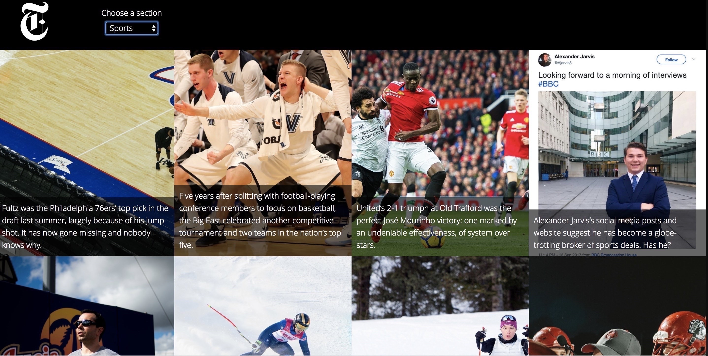

# Project 2 Instanews

In this project, my to create a responsive website that was able to update itself by accessing top stories from the New York Times through using their API. 

#Resources

HTML5,CSS3,Sass,JavaScript,jQuery 3.2.1,Gulp,Es Lint,Pretty Error

First I did my HTML markup. Then I went on to set up gulp on my terminal, where I could also add in plugins such as EsLint and browsersync. After having gulp set-up I went on to write Javascript code that would grab articles using the New York Times API. Once I was successful in grabbing the articles and their corresponding photos, I then went on to use Sass to style my page in order to create a website that would resemble the design photos given. 

#Personal Growth

This was quite a difficult project, mainly because of the Javascript component. Because of my inexperience with the language, I found it difficult to know whether or not I was on the right path or where to even start sometimes. I found it as a great learning project and wish I could spend more times doing examples and small projects where I can consistanly practice my Javascript code. I had alot of trouble with my Gulp the past week, and because of that, spent many of my hours trying to troubleshoot and understand what the problem was. Because of that, it made me rush the Instanews project more than I'd like. I'm quite satisfied with what I have created in the time frame I had, and will definetely come back to look over this project in the future. 